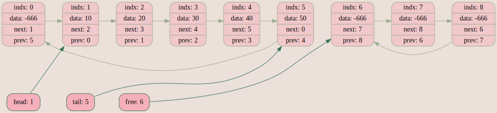
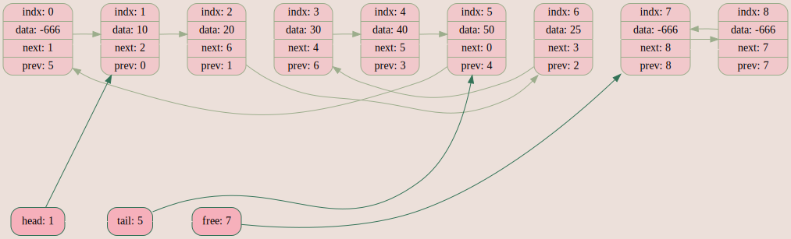
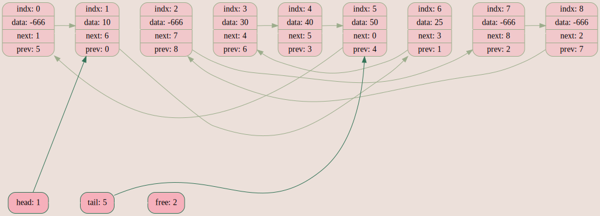
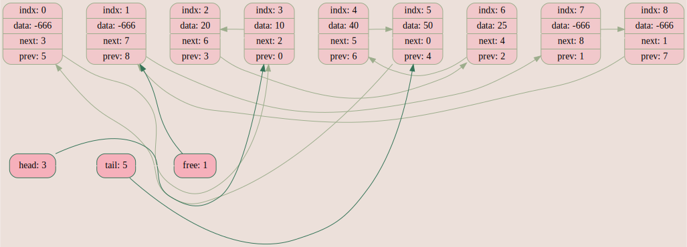

# Список

## Введение

Моя собственная структура данных, представляющая собой двухсвязнй список.

## Скачивание и установка проекта

Для установки программы используются утилиты `make` и `git`.

```CMake
    git clone git@github.com:ksshkh/list.git
    make
```

## Принцип работы

Список реализован с помощью массива, что существенно ускоряет выполнение операций с ним. Так, например, поиск n-ного элемента в линеаризованном списке осуществляется за o(1).

Также реализована визуализация списка с помощью Graphviz, что облегчает его отладку и работу с ним.

### Поддерживаемые функции



1. Вставка элемента (как по физическому, так и по логическому адресу)



2. Удаление элемента



3. Swap двух любых элементов



4. Линеаризация


5. Список автоматически реаллоцируется/аллоцируется в зависимости от количества элементов в нём